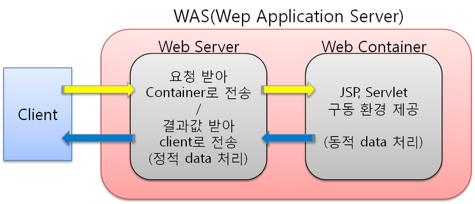

# 웹서버 VS WAS?

## 의미
* 웹 서버 : 정적인 웹 리소스를 반환
* WAS : 동적인 웹 리소스를 반환(웹 서버 + 웹 컨테이너)

## 웹서버와 WAS를 분리해야 하는 이유

1. 기능을 분리하여 서버의 부하 방지

2. 물리적으로 분리하여 보안강화

3. 여러대의 WAS를 웹 서버에 연결 가능

    *  이는 로드밸런싱의 역할 및 fail over, fail back 처리에 유리
    

4. 여러 웹 어플리케이션 구동 가능